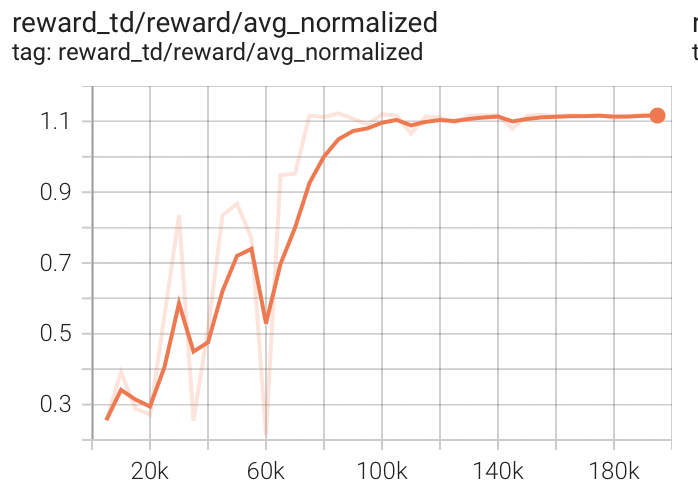

# TrajectoryDiffuser
About Official Pytorch Implementation for "[Diffusion Models as Optimizers for Efficient Planning in Offline RL](https://arxiv.org/abs/2407.16142)" (ECCV 2024)

# Quick start
require:python==3.8
```
pip install -r requirements.txt

python main.py
```

# Result
hopper-medium-expert-v2

